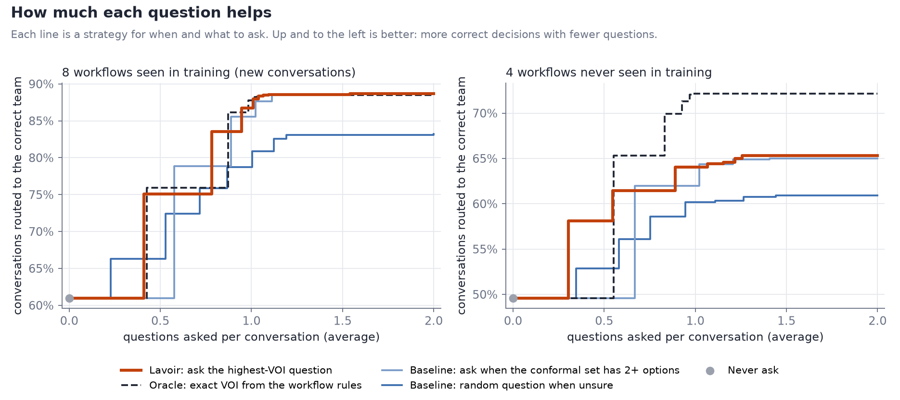
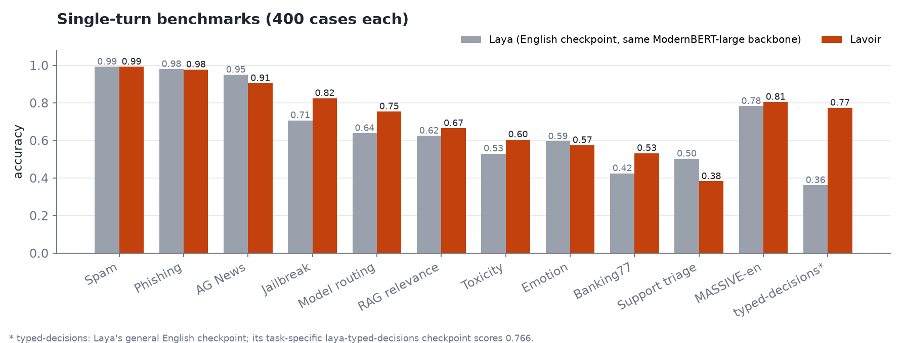

<p align="center">
  
</p>

<p align="center">
  <a href="https://huggingface.co/moganai/lavoir"></a>
  <a href="https://moganai.github.io/"></a>
  <a href="https://buymeacoffee.com/moganai"></a>
</p>

# Lavoir

Lavoir is a decision model that knows when it lacks information. Given a conversation, a typed question (which
team, yes/no, a score) and a list of things it could still ask, it returns in one forward pass:

- a calibrated probability for every option, and
- for every candidate question, its **value of information (VOI)**: how much the probability of the correct
  option is expected to rise if that question is asked.

A single rule turns this into behaviour: ask the question with the highest VOI while it is worth more than a
threshold, then decide (or hand off to a human). No separate "should I ask" policy is trained, and no text is
generated.

Lavoir extends [Laya](https://github.com/NandhaKishorM/laya) (ModernBERT-large encoder, typed decisions,
calibrated probabilities). Without candidate questions its input is exactly Laya's format.

```text
customer: hi, i need help with my recent purchase. i would like a replacement for the item.
          can you help me with that? thanks

probabilities  returns_desk 0.350  logistics 0.297  marketplace_support 0.287  warranty_service 0.066
VOI            seller 0.197  problem 0.171  delivery_age 0.036  wants 0.003  customer_name 0.001

ask  seller   (VOI 0.197)  Was the item sold by us directly or by a seller on our marketplace?
     -> The item was sold by our store.
ask  problem  (VOI 0.385)  What is the problem with your order?
     -> The item arrived damaged.
decide: logistics (p = 1.000)
```

Deciding from the first message alone would have picked `returns_desk`, which is wrong. After the first answer the
model is still split between two teams, so the second question is worth more than the first (0.385). It asks
nothing about the customer's name, because the name cannot change the decision.

## How it works

```
[CLS] choice question: <instruction> [SEP]
[MASK] <option 1>: <description>  [MASK] <option 2>: ...  [SEP]
missing information: [MASK] <slot 1>: <description>  [MASK] <slot 2>: ...  [SEP]
<conversation> [SEP]
```

- **Decision head** (from Laya): the hidden state at each option marker is scored; a softmax with a fitted
  temperature gives the probabilities.
- **VOI head**: the hidden state at each slot marker plus summary features of the (detached) decision
  distribution go through a small MLP. The output is bounded by the Gini impurity of the decision,
  `VOI = (1 - sum p^2) * sigmoid(h)`: a calibrated model cannot expect a larger gain, and a confident model
  therefore never asks.
- **Training target** for slot k: `p_k(gold) - p_0(gold)`, where `p_0` is the model's probability for the
  correct option now and `p_k` after the question of slot k and one sampled answer are appended. Averaged over
  answers this is the expected gain, which is what the head learns to predict.
- **Rule**: `k = argmax VOI`; if `VOI[k] > ask_threshold` ask it; otherwise decide `argmax p`, or hand off if
  `1 - max p > handoff_threshold`.

## Install

```bash
git clone <this repository> && cd lavoir
pip install -e .            # installs laya, torch, transformers, safetensors
```

The model weights are a separate download (`config.json`, `model.safetensors`, `tokenizer/`, `encoder/`).
`Lavoir.from_pretrained` accepts that directory or its Hugging Face Hub repo id.

## Use

```python
from lavoir import Lavoir

model = Lavoir.from_pretrained("moganai/lavoir")      # or a local checkpoint directory; GPU if available

question = {"type": "choice", "instructions": "Which team should handle this order problem?",
            "criteria": {"returns_desk": "returns desk: standard returns and exchanges",
                         "logistics": "logistics: replacements for damaged or wrong deliveries",
                         "marketplace_support": "marketplace support: orders from third-party sellers"}}
slots = {"seller":  {"description": "who sold the item",
                     "question": "Was the item sold by us directly or by a seller on our marketplace?"},
         "problem": {"description": "what is wrong with the order",
                     "question": "What is the problem with your order?"}}
state = [{"role": "user", "text": "Hi, I'd like a replacement for something I bought."}]

pred = model.predict(state, question, slots)
pred.probabilities, pred.voi, pred.choice, pred.best_question

step = model.next_action(state, question, slots, ask_threshold=0.05)
if step.action == "ask":
    state += [{"role": "system", "text": step.question}, {"role": "user", "text": "<customer reply>"}]
    step = model.next_action(state, question, slots, asked=[step.slot])
```

- **state**: a string, a dict of named fields, or a list of turns. The model was trained with `"user"` for the
  customer and `"system"` for the assistant's questions.
- **question**: Laya's typed format. `choice` takes `criteria` as `{option: description}`, `noul` is yes/no
  (`noul` returns P(true) under key `"true"`), `score` takes an ordered list of levels.
- **slots**: the information still missing, as `{name: description}` or `{name: {"description", "question"}}`.
  Leave out slots that were already asked. Up to ~8 slots fit comfortably.
- **Thresholds**: `ask_threshold=0.05` is a good default (a question must be expected to raise p(correct) by 5
  points). Raise it to ask less. `handoff_threshold` is off by default; `0.3` hands off when the best option is
  below 70% after the questions.
- **Calibration**: two sets of temperatures were fitted. Requests with slots use the one fitted on the
  question-asking workflows, requests without slots the one fitted on general single-turn data. Force one with
  `calibration_source="voi" | "general" | <training source name>` (the source names, such as `enron_spam` or
  `support_tickets`, are listed under `temperature_by_source` in the checkpoint's `config.json`).
- `model.run_dialogue(state, question, slots, answer=fn)` runs the rule end to end with a callback that supplies
  the replies. `examples/chat_demo.py` is an interactive version and `examples/quickstart.py` reproduces the
  example above.

## Data format

One JSON object per line. `examples/data/format.jsonl` has one example of each kind.

| field | required | meaning |
|---|---|---|
| `state` | yes | string, dict, or list of `{"role", "text"}` turns |
| `question` | yes | `{"type", "instructions", "criteria"}` |
| `target` | yes | `{option: probability}`; one-hot for plain labels, soft when the answer is uncertain |
| `id` | recommended | unique id (filled in from the file position when missing) |
| `workflow` | recommended | source name, used for per-source metrics and temperatures |
| `split` | no | `"train"` (default), `"test"`, ... |
| `gold` | for VOI | the correct option |
| `slots` | for VOI | `{name: description}` of the information still missing |
| `probes` | for VOI | `{slot: {"q": question, "a": answer}}`: one realistic answer per slot, as this customer would give it |

Single-turn classification data needs only `state`, `question` and `target`. To teach the model which question to
ask, add examples with `gold`, `slots` and `probes`, taken at different points of a conversation (first message,
after one answer, ...). Answers may be vague or "I don't know"; that is information the model should learn to
price. Include slots that do not affect the decision (for example the customer's name) so the model learns to
give them a VOI of 0.

## Fine-tune

`scripts/finetune.sh` wraps both modes.

**Decision only** (your labeled single-turn data, no questions). The VOI head and its temperature are kept:

```bash
torchrun --nproc_per_node 1 -m lavoir.train --phase decision --init path/to/lavoir-model \
    --data "my_data/*.jsonl" --out runs/ft --epochs 1 --lr_encoder 1e-5 --batch_size 16
```

**With your own questions** (examples with `slots`, `probes`, `gold`; mix in single-turn data to keep general
behaviour):

```bash
python -m lavoir.targets --checkpoint path/to/lavoir-model --data "my_data/*.jsonl" --out runs/voi_targets.jsonl
torchrun --nproc_per_node 1 -m lavoir.train --phase joint --init path/to/lavoir-model \
    --voi_targets runs/voi_targets.jsonl --data "my_data/*.jsonl" --out runs/ft --epochs 1 --batch_size 16
```

Every run holds out `--calib_frac` (5%) of the data, reports per-source accuracy / ECE / KL each epoch and refits
the temperatures at the end. `--phase temperature` refits them without training. Output directories are complete
checkpoints that `Lavoir.from_pretrained` loads directly.

Evaluate on held-out data:

```bash
python -m lavoir.evaluate --checkpoint runs/ft/joint --data "my_data/*.jsonl" --split test --out runs/eval
```

It reports decision accuracy, ECE and KL per source, and for examples with probes, how well the predicted VOI
tracks the realized gain (Spearman, MAE, agreement on the best question). Per-example values are written next to
the summary.

## Train from scratch

`scripts/train_from_scratch.sh` runs the recipe of the released model:

1. **decision**: ModernBERT-large + new heads, 500 head warm-up steps with a frozen encoder, then 4 epochs
   (encoder LR 2.5e-5, head LR 1e-4, cosine schedule, global batch 64, bf16);
2. VOI targets from that snapshot, **joint** phase for 2 epochs (encoder LR 5e-6, VOI loss weight 1);
3. VOI targets refreshed from the joint snapshot, **joint** phase for 1 more epoch.

The decision loss is Laya's: soft cross-entropy plus an optional GRPO term on noisy logits rewarded by proper
scoring rules (`--w_rl`, default 0). We found the GRPO term dominates the shared gradients once the decision
has converged and slows down the VOI head without improving accuracy, so the released model uses `--w_rl 0`.
Use `torchrun` for multiple GPUs; `--batch_size` is per GPU. The released model took about 50 minutes for the
decision phase and 28 minutes for the two joint phases on 16 GH200 GPUs.

## Results

Released checkpoint, evaluated on data never used in training.

**Question asking** on 8 customer-service workflows (held-out conversations) and 4 workflows never seen in
training. The oracle knows each workflow's rules and computes the exact expected VOI. "Budget": best accuracy at
no more than 0.5 questions per conversation on average; "AUC": normalized area under the accuracy-vs-questions
curve (0 to 2 questions).



| policy | AUC, seen | budget 0.5, seen | AUC, unseen | budget 0.5, unseen |
|---|---|---|---|---|
| never ask | .610 | .610 | .496 | .496 |
| random question when unsure | .760 | .663 | .572 | .529 |
| conformal set > 1, ask the VOI question | .789 | .610 | .592 | .496 |
| **Lavoir** | **.799** | **.751** | **.612** | **.581** |
| oracle VOI (exact) | .797 | .760 | .649 | |

On seen workflows the first-message decision is at the Bayes ceiling (accuracy .648 vs .659, ECE .016), VOI
correlates with the oracle at Spearman .85 and picks the oracle's best question 94% of the time. With
`ask_threshold=0.05` it asks 1.06 questions per conversation, accuracy goes from .610 to .885, and 0.3% of its
questions are about something already known or irrelevant. On unseen workflows the decision itself is weaker
(.514 vs a ceiling of .667).

**Real conversations, zero-shot** (neither dataset was used in training):

| | accuracy | ECE | asks (threshold .05) | AUROC, VOI flags errors |
|---|---|---|---|---|
| SGD, first user turn, 3,812 (2,766 from unseen services) | .942 | .044 | 6% | .84 |
| ABCD, first customer message, 918 | .657 | .186 | 49% | .71 |

On SGD, the conversations it asks about have 63% first-message accuracy and the ones it does not ask about 96%.
On ABCD, a real agent question and customer answer lift accuracy by 9.1 points in the conversations Lavoir chose
to ask about, and by 0.4 points in the rest.

**Single-turn benchmarks** (Laya's application suite, 400 cases each, same prompts; plus MASSIVE-en and
typed-decisions). "Laya (English)" has the same ModernBERT-large backbone; "Laya best" is the best of its three
published checkpoints on each task.



| task | Lavoir | Laya (English) | Laya best | source in Lavoir's training |
|---|---|---|---|---|
| Email spam | **.993** | .993 | .993 | train split |
| Phishing | .978 | **.980** | .993 | yes, benchmark texts removed |
| AG News | .905 | **.950** | .953 | train split |
| Jailbreak (toxic-chat) | **.825** | .708 | .763 | no |
| Model routing | **.754** | .639 | .659 | related data (train splits) |
| RAG relevance (MS MARCO) | **.665** | .625 | .658 | train split |
| Toxicity (toxic-chat) | **.605** | .530 | .530 | no |
| Emotion (DAIR) | .575 | **.595** | .600 | no |
| Banking77 (77 labels) | **.533** | .425 | .493 | no |
| Support triage | .383 | **.503** | .523 | yes, benchmark texts removed |
| MASSIVE-en intent | **.805** | .783 | .783 | no |
| typed-decisions | **.774** | .362 | .766 | train split |

Calibration (ECE) and option-order robustness per task are in the model card (`MODEL_CARD.md`).

Latency: 31 ms median for one question on a GH200 (bf16).

## Limitations

- **English only.** The encoder and all training data are English.
- **Questions come from a list.** Lavoir chooses among the slots you provide; it does not write new questions.
- **New workflows are harder.** On workflows unlike the training ones the decision is noticeably weaker, and so
  is VOI. Fine-tuning on a few hundred examples of your workflow is the intended path.
- **Overconfidence out of distribution.** On ABCD some wrong answers come with confidence above 0.99. Because VOI
  is bounded by the model's own uncertainty, it does not ask in those cases. Check calibration on your data.
- **VOI is only as good as the probes.** Training answers should look like what real users say, including vague
  and "I don't know" answers.

## Tests

```bash
pip install -e ".[test]"
pytest                          # set LAVOIR_TOKENIZER to a local ModernBERT tokenizer to run offline
LAVOIR_ENCODER=/path/to/ModernBERT-large pytest -m slow   # exact equivalence with Laya on the full model
```

## Citation

```bibtex
@misc{yilmaz2026lavoir,
  title        = {Lavoir: A Single-Pass Decision Model That Knows Which Question to Ask},
  author       = {Furkan Yilmaz and Habibe Aleyna Tasdemir and Muhammed Faruk Gozay},
  year         = {2026},
  howpublished = {\url{https://huggingface.co/moganai/lavoir}}
}
```

## License and attribution

Code: Apache-2.0 (see `LICENSE` and `NOTICE`). Lavoir builds on Laya (Apache-2.0) and ModernBERT (Apache-2.0).
The license of the released weights and the training data sources are listed in the model card.
